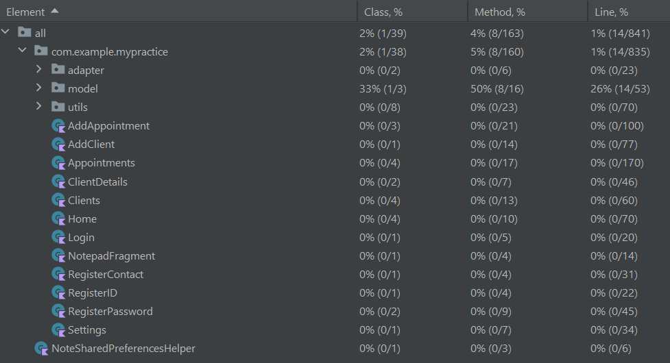
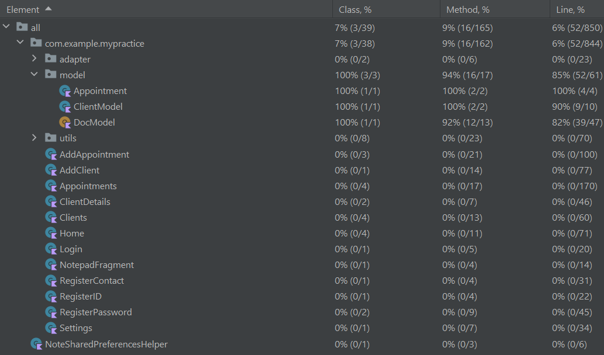

## Test coverage measurement

We enabled test coverage to evaluate the overall quality and reliability of our code and that by 
measuring which parts of the application are executed during testing  we aimed to identify 
untested areas, reveal potential flaws, and ensure that our important features are functioning correctly. 
The resulting coverage percentage served  as a guide to extend our tests each time.

After adding the **enableUnitTestCoverage = true** in the build.gradle file and executing the 
tests with coverage enabled for the first time . We found that not enough tests  were present. 
To solve this, we introduced new ui and unit  testing classes  such as the  LoginTest class, 
the RegisterContactTest  class and the AddAppointmentTest class . Even after adding the tests 
providing some coverage  much of the code still remained untested. This is due to the heavy 
reliance on complex UI components like combo boxes and number pickers  which are designed to 
capture user input directly through interactive graphical elements. Testing these components 
posed a significant challenge because they don't easily lend themselves to automated UI testing. 
They require real-time interaction and user feedback  which isn't possible to simulate in unit tests. 
This means that putting data directly into these methods was challenging without modifying the app's source code. 

**Test Coverage Measurement Result:**
Before adding unit tests:

After addition of unit tests:
